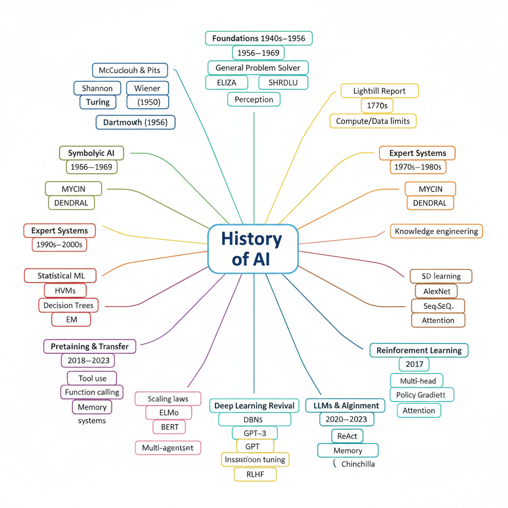
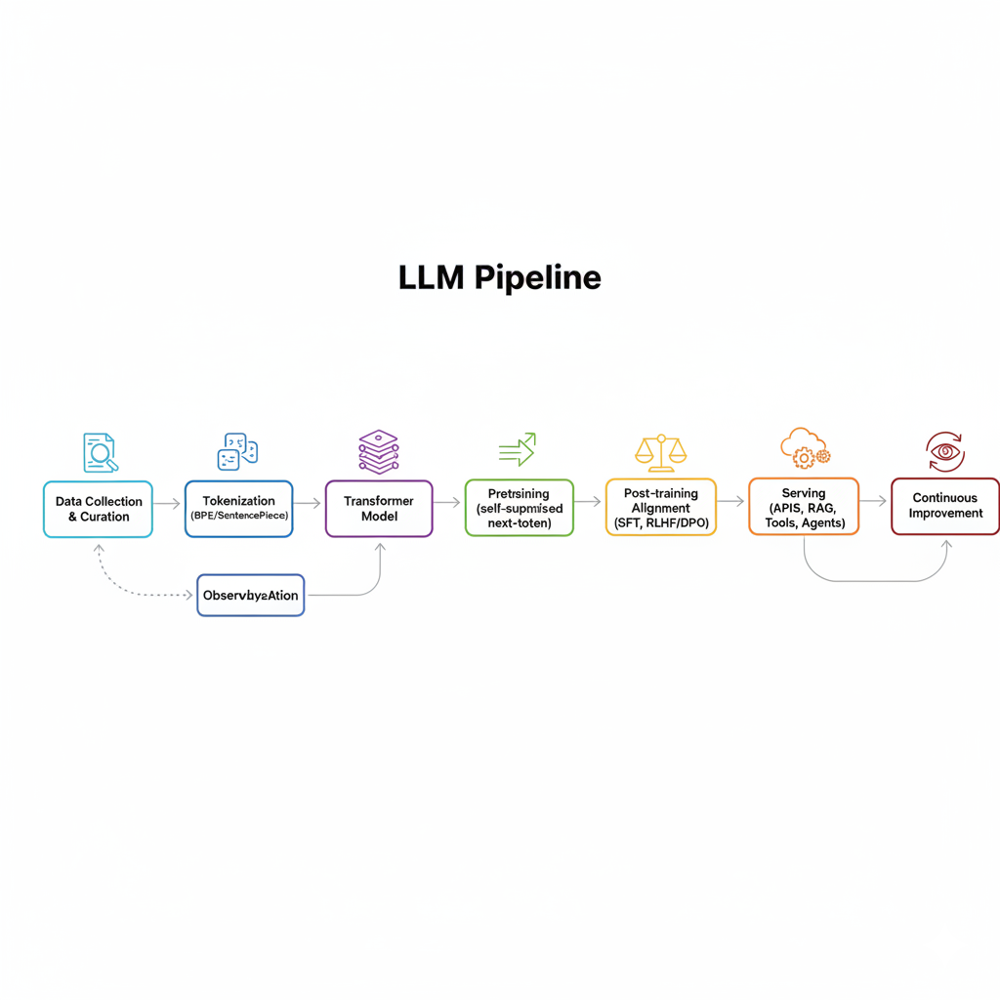
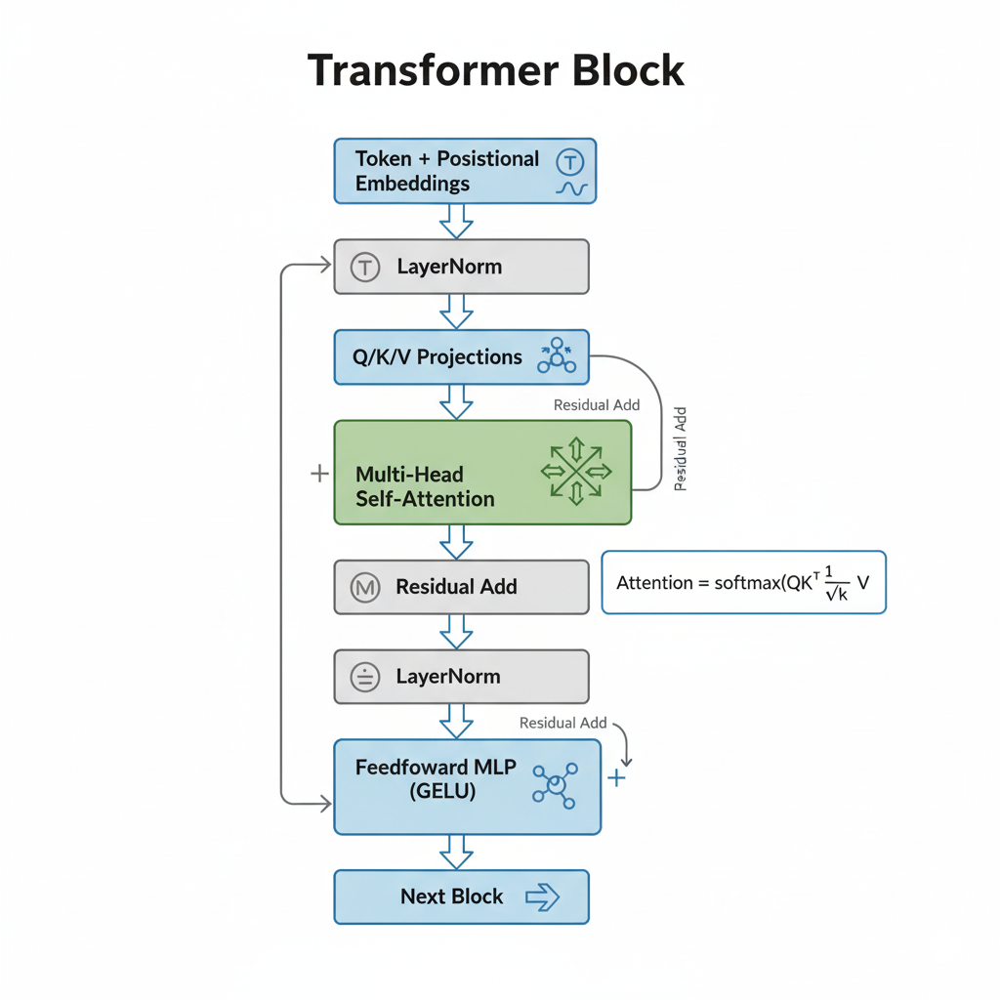
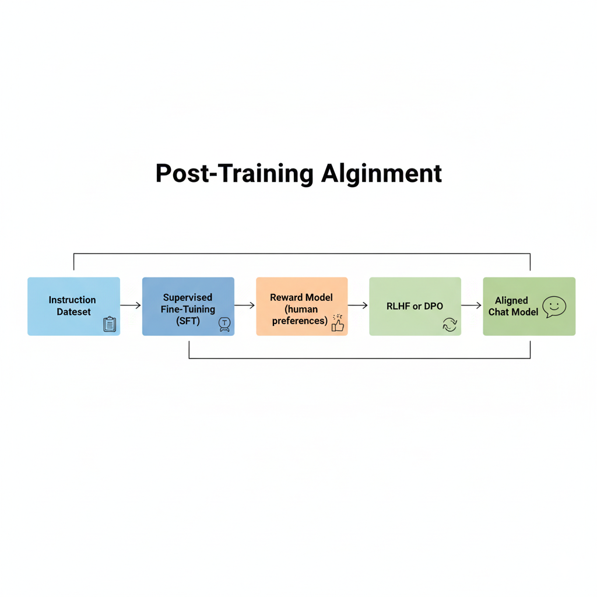
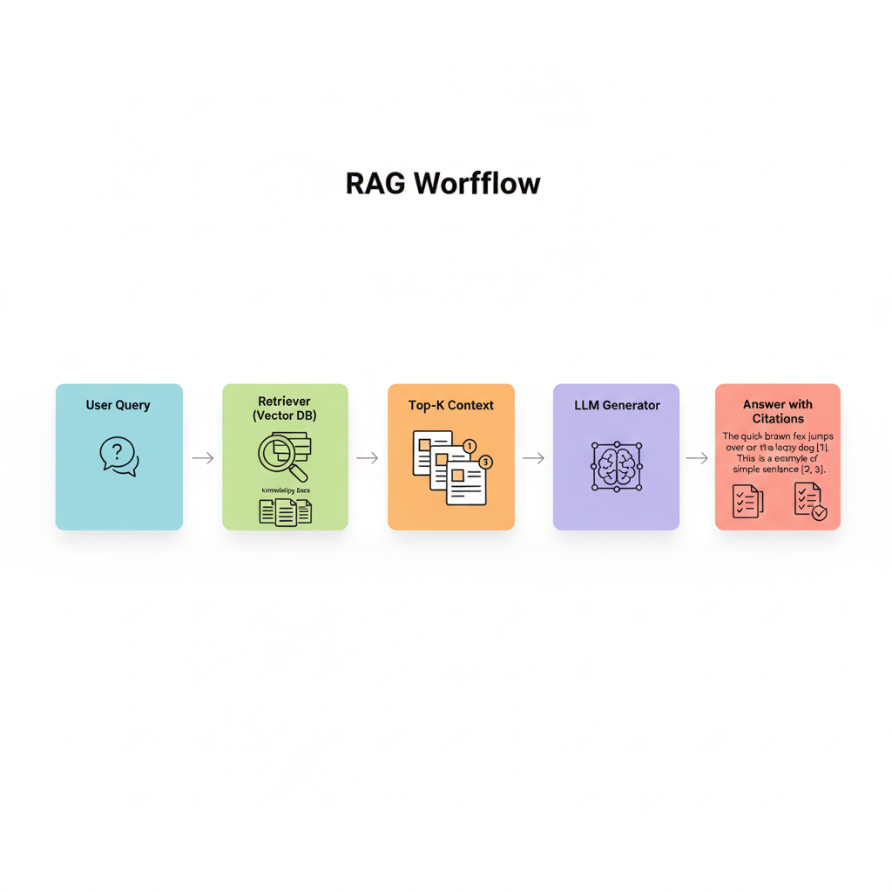
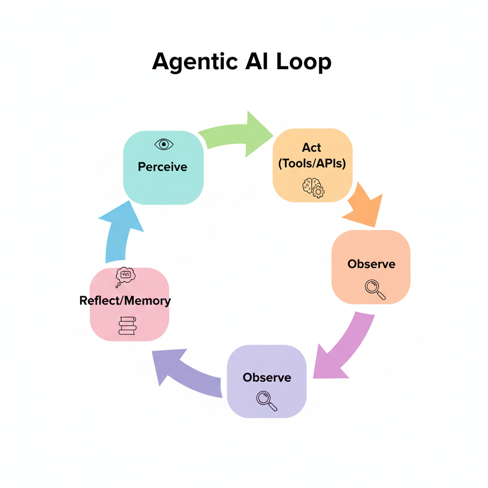
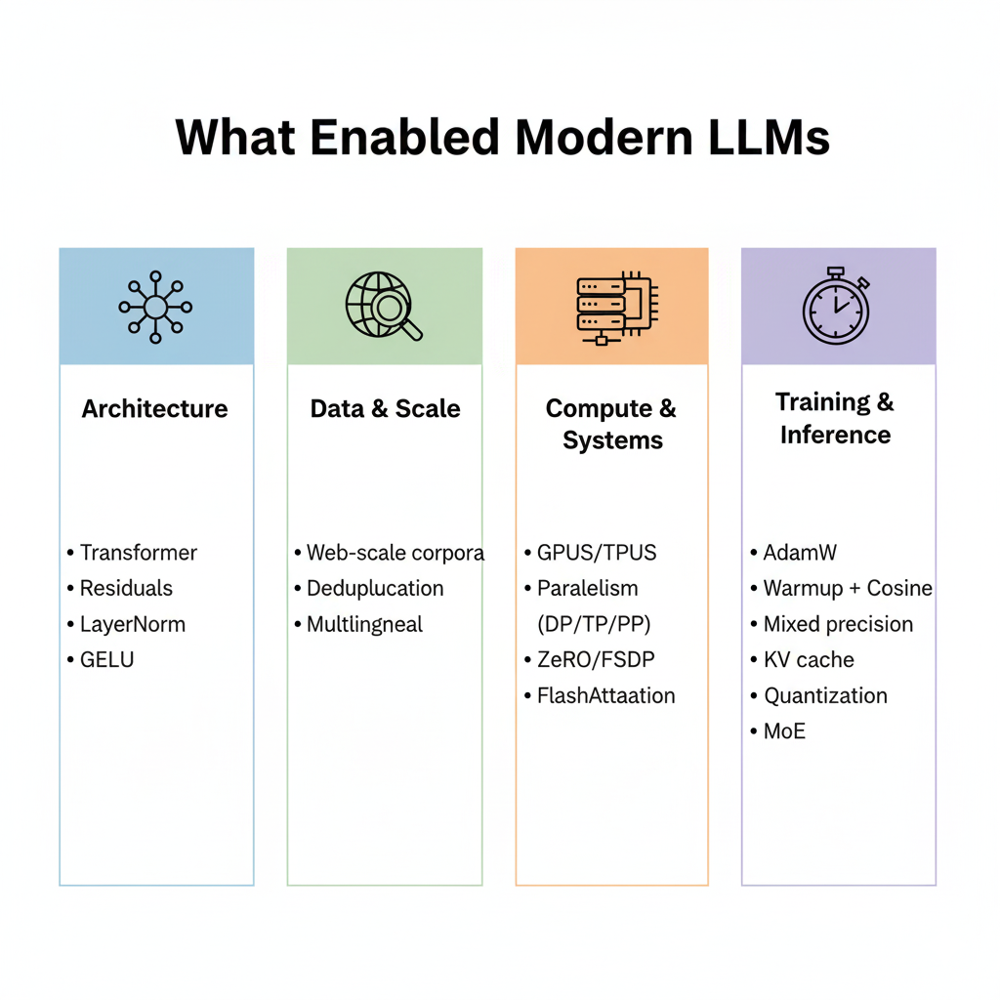

# 🧠 The History of AI  
From Symbolic Systems to Agentic AI

- Evolution, key milestones, paradigm shifts  
- How LLMs work + breakthroughs  
- From LLMs to Agentic AI  

---

## 📋 Agenda
1. Foundations (1940s–1956)  
2. Symbolic AI → Expert Systems  
3. Statistical ML (1990s–2000s)  
4. Deep Learning → Transformer  
5. LLMs: How They Work + Alignment  
6. Agentic AI, Risks, and What’s Next  

---

## 🏛️ Foundations (1940s–1956)
- 1943: McCulloch & Pitts — Neural nets as logic  
- 1950: Alan Turing — *The Imitation Game*  
- Shannon & Wiener — Information theory, cybernetics  
- 1956: Dartmouth Workshop — Term “Artificial Intelligence” coined  

---

## 🧩 Symbolic Era (1956–1969)
- GOFAI: Logic, search, and planning  
- Systems: Logic Theorist, GPS, ELIZA, SHRDLU  
- Perceptron (Rosenblatt): Early neural optimism  
- **Limits:** Brittleness, combinatorial explosion  

---

## ❄️ First AI Winter (1970s)
- 1969: Minsky & Papert critique Perceptrons  
- 1973: Lighthill Report → Funding cuts  
- Limited data and compute → research slowdown  

---

## ⚙️ Expert Systems (1970s–1980s)
- Knowledge-based systems, rule inference  
- Examples: MYCIN, DENDRAL, XCON  
- **Pros:** Narrow domain success  
- **Cons:** Brittle, costly to maintain, poor scalability  

---

## 📊 Statistical ML (1990s–2000s)
- Bayesian Networks, HMMs, EM Algorithm  
- SVMs, Decision Trees, Ensembles  
- Reinforcement Learning: TD, Q-learning, Policy Gradient  
- **Applications:** Speech, OCR, Recommendation systems  

---

## 🤖 Deep Learning Revival (2006–2016)
- Deep Belief Networks (2006), GPUs, Big Data  
- Techniques: ReLU, Dropout, BatchNorm  
- **ImageNet 2012:** AlexNet breakthrough  
- Seq2Seq, Attention, ResNet architectures  

---

## ⚡ The Transformer (2017)
- *“Attention Is All You Need”*  
- Introduced Self-Attention + Multi-Head mechanisms  
- Enables parallel sequence modeling  
- Foundation for GPT, BERT, T5, and LLaMA  

---

## 🔄 Pretraining & Transfer (2018–2020)
- Models: ELMo, BERT (masked LM), GPT (generative pretrain)  
- Fine-tuning → task transfer without retraining  
- Marked start of **generalized NLP capabilities**  

---

## 🚀 Scaling to LLMs (2020–2023)
- GPT-3: Few-shot behavior emerges  
- Scaling laws & Chinchilla data/compute tradeoff  
- Instruction tuning, RLHF → chat models  
- Open-source wave: LLaMA, Falcon, Mistral  

---

## 🧠 How LLMs Work
- Objective: **Next-token prediction**  
- Architecture: Transformer (decoder or encoder–decoder)  
- Training: Self-supervised on web-scale text  
- Post-training: SFT, RLHF/DPO, safety tuning  
- Inference: Sampling, KV cache, quantization  

---

## ⚙️ LLM Pipeline

---

## 🔍 Inside a Transformer Block

**Flow:** Embeddings → Self-Attention → Residuals → MLP → Residuals  

---

## 🤝 Alignment

**Stages:** SFT → Reward Model → RLHF/DPO → Aligned Chat Model  

---

## 🧩 Retrieval-Augmented Generation (RAG)

Retriever injects **fresh, factual context** to reduce hallucinations.  

---

## 🧭 Agentic AI

**Agents = LLMs + Tools + Memory + Goals**  
They can plan, reason, and act autonomously to achieve objectives.  

---

## 🌟 Breakthroughs Enabling LLMs

**Key Enablers:**  
- Scalable Transformer Architectures  
- Massive Data + Compute (GPUs/TPUs)  
- Efficient Training (Mixed Precision, Checkpointing)  
- Reinforcement Learning from Human Feedback (RLHF)  

---

## ⚖️ Opportunities and Risks
- **Opportunities:** Productivity, discovery, accessibility  
- **Risks:** Hallucinations, bias, misuse, IP/privacy  
- **Mitigations:** RAG, guardrails, evaluations, monitoring  

---

## 🔮 What’s Next
- Smarter tool use & planning (robust agents)  
- Personalization with privacy  
- Multimodal reasoning (vision, audio, action)  
- On-device AI via quantization & MoE models  

---

## 🧾 Summary
- **AI’s journey:** From symbolic logic → neural learning → LLMs → Agents  
- **LLMs work:** Predict next tokens using Transformer architecture  
- **Breakthroughs:** Scaling, data, architecture, RLHF  
- **Future:** Agentic, personalized, multimodal AI  

---

# 🙋‍♂️ Q&A
Thanks for listening!  
Let’s discuss how Agentic AI will reshape the future.
